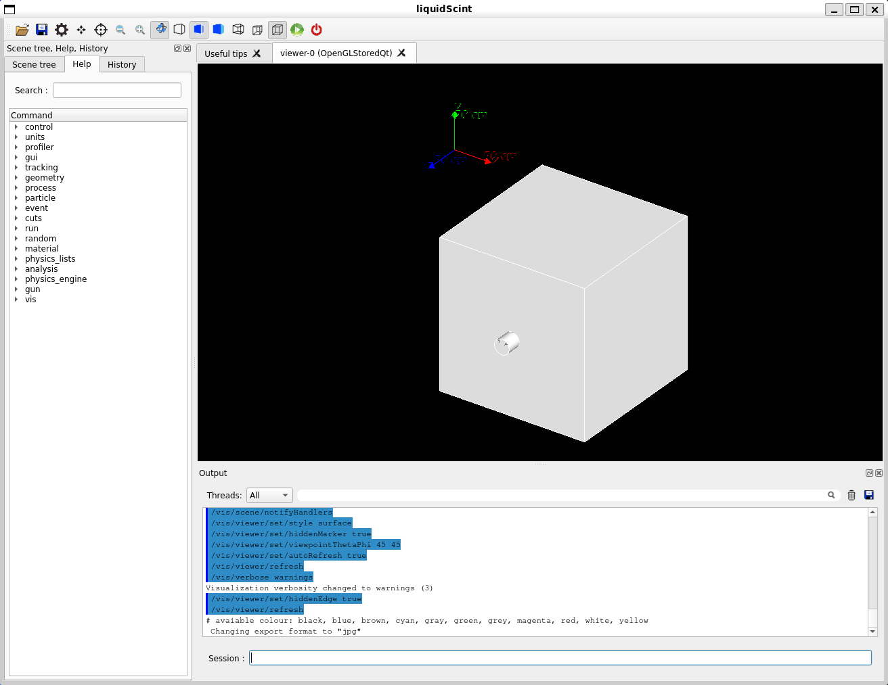
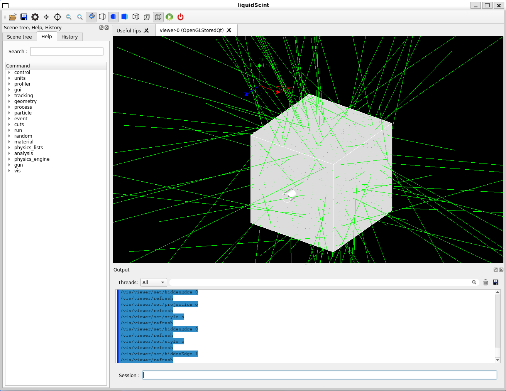
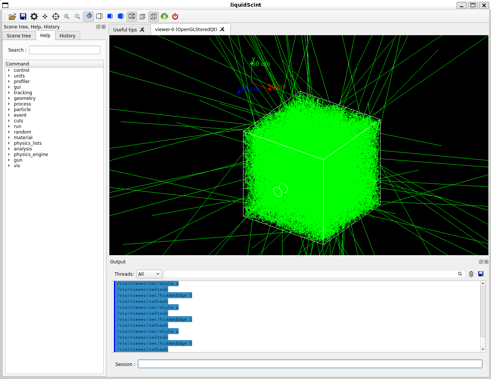

<a name="readme-top"></a>

<!-- PROJECT HEAD -->
<div align="center">
  <h1 align="center">liquidScint</h1>

  <p align="center">
    A Simple GEANT4 Liquid Scintillator Simulation
    <br />
  </p>
</div>


<!-- TABLE OF CONTENTS -->
<details>
  <summary>Table of Contents</summary>
  <ol>
    <li>
      <a href="#about-the-project">About The Project</a>
    </li>
    <li>
      <a href="#how-to-build">How to build</a>
    </li>
    <li>
      <a href="#usage">Usage</a>
    </li>
    <li>
      <a href="#simulation-output">Simulation Output</a>
    </li>
    <li>
      <a href="#drawing-histogram">Drawing histogram</a>
    </li>
    <li>
      <a href="#development-guide">Development Guide</a>
    </li>
    <li>
      <a href="#repository-history">Repository History</a>
    </li>
  </ol>
</details>


<!-- ABOUT THE PROJECT -->
## About The Project

This GEANT4 simulation is an educational code for undergraduate students who are new to GEANT4 to study the properties of liquid scintillators.
The motivation is to investigate whether liquid scintillator can distinguish Cerenkov & scintillation photons.
By changing the properties of the liquid scintillator, you can see which cocktail distinguishes the timing of Cerenkov and scintillation.

This project is compatible with GEANT4 version 11 or higher.

<p align="right">(<a href="#readme-top">back to top</a>)</p>


<!-- HOW TO BUILD -->
## How to build
```bash
$ mkdir liquidScint
$ cd liquidScint
$ git clone git@github.com:HoyongJeong/liquidScint.git source
$ mkdir build
$ cd build
$ cmake ../source
$ make -j
```
<p align="right">(<a href="#readme-top">back to top</a>)</p>


<!-- USAGE -->
## Usage

### Print help message
`./liquigScint -h` shows help message:
```bash
$ ./liquigScint -h
usage: liquidScint [-b] [-g] [-m macrofile]

Examples:
  liquidScint -b -m myRun.mac  # Run in batch mode with macro.
  liquidScint -g               # Run in graphical mode.

Options:
  -b  Execute in batch mode
  -g  Execute in graphical mode
      Note: Default is command mode
  -h  Show help message
  -m  Run with macro
```

### Graphical Mode
Executing `./liquidScint -g` will open a GUI window like,


Typing a command such as `/run/beamOn 1` generates a primary particle:


With wire frame view, one can see photons inside the liquid scintillator:


### CLI Mode
`./liquidScint` opens a command-line interface.

### Batch Mode
Running GEANT4 simulation in GUI mode, in general, requires graphical resource, thus really slow and takes a lot of time, even the process may be broken.
A batch run is recommended to get sizable statistics. The code includes an example macro file `run_10k.mac`. This macro runs 10,000 events.
```bash
./liquidScint -b -m run_10k.mac
```

<p align="right">(<a href="#readme-top">back to top</a>)</p>


<!-- SIMULATION OUTPUT -->
## Simulation Output
ROOT files with name of `liquidScint_YYYY-MM-DD_HH_mm_SS_tN.root` will be created. N can vary depending on multithreading configuration.
The tree structure is simple. The following is a printed result of a summary of the tree contents:
```bash
$ root -l liquidScint_YYYY-MM-DD_HH_mm_SS_tN.root
root [0]
Attaching file liquidScint_YYYY-MM-DD_HH_mm_SS_tN.root as _file0...
(TFile *) 0x56509f7ce4c0
root [1] .ls
TFile**         liquidScint_YYYY-MM-DD_HH_mm_SS_tN.root
 TFile*         liquidScint_YYYY-MM-DD_HH_mm_SS_tN.root
  KEY: TTree    liquidScint;1   Cerenkov and Scintillation
root [2] liquidScint -> Print();
******************************************************************************
*Tree    :liquidScint: Cerenkov and Scintillation                             *
*Entries :     1748 : Total =           73037 bytes  File  Size =      38489 *
*        :          : Tree compression factor =   1.00                       *
******************************************************************************
*Br    0 :eventID   : Int_t liquidScint                                      *
*Entries :     1748 : Total  Size=      14661 bytes  One basket in memory    *
*Baskets :        0 : Basket Size=      32000 bytes  Compression=   1.00     *
*............................................................................*
*Br    1 :creProcID : Int_t liquidScint                                      *
*Entries :     1748 : Total  Size=      14671 bytes  One basket in memory    *
*Baskets :        0 : Basket Size=      32000 bytes  Compression=   1.00     *
*............................................................................*
*Br    2 :timing    : Double_t liquidScint                                   *
*Entries :     1748 : Total  Size=      21656 bytes  One basket in memory    *
*Baskets :        0 : Basket Size=      32000 bytes  Compression=   1.00     *
*............................................................................*
*Br    3 :energy    : Double_t liquidScint                                   *
*Entries :     1748 : Total  Size=      21656 bytes  One basket in memory    *
*Baskets :        0 : Basket Size=      32000 bytes  Compression=   1.00     *
*............................................................................*
```
And here is a scan:
```bash
root [3] liquidScint -> Scan();
************************************************************
*    Row   * eventID.e * creProcID * timing.ti * energy.en *
************************************************************
*        0 *       300 *         0 * 78.701582 * 3.9274853 *
*        1 *       300 *         0 * 38.655195 * 3.3350945 *
*        2 *       300 *         0 * 23.254868 * 2.1247994 *
*        3 *       300 *         1 * 68.615418 * 3.9001964 *
*        4 *       300 *         1 * 67.405053 * 2.1813997 *
*        5 *       300 *         0 * 97.938746 * 3.7373632 *
*        6 *       300 *         0 * 20.217837 * 2.4136045 *
*        7 *       300 *         0 * 143.16226 * 3.7114624 *
*        8 *       301 *         1 * 15.096743 * 3.2965141 *
*        9 *       301 *         0 * 25.903200 * 2.4761763 *
*       10 *       301 *         0 * 18.975242 * 2.6722779 *
*       11 *       301 *         1 * 196.58997 * 2.6274329 *
*       12 *       301 *         1 * 55.280241 * 2.6523327 *
*       13 *       301 *         0 * 44.586589 * 3.9446059 *
*       14 *       301 *         0 * 14.581937 * 2.5583662 *
*       15 *       301 *         0 * 113.15928 * 3.7191482 *
*       16 *       302 *         1 * 107.86879 * 3.1937989 *
*       17 *       303 *         0 * 58.326406 * 2.9899661 *
*       18 *       303 *         0 * 17.070357 * 3.4252924 *
*       19 *       303 *         0 * 30.908717 * 3.6675304 *
*       20 *       303 *         0 * 30.451180 * 4.1324666 *
*       21 *       303 *         0 * 55.810628 * 2.5543036 *
*       22 *       303 *         1 * 221.27118 * 3.3847349 *
*       23 *       304 *         0 * 45.450426 * 2.5922287 *
*       24 *       304 *         0 * 10.233816 * 2.1772793 *
...
```
`creProcID` refers to the ID of creation process. 0 means this photon has been created by Cerenkov radiation, whereas 1 means scintillation.
The unit of time is nanosecond and eV for that of energy.

<p align="right">(<a href="#readme-top">back to top</a>)</p>


<!-- DRAWING HISTOGRAM -->
## Drawing histogram
Please use scripts/DrawHist.C or write by yourself.
```bash
$ root scripts/DrawHist.C
```
The `scripts/DrawHist.C` script draws histograms of time distribution. The time is when photons are detected by PMT. t = 0 is when the primary particle is shot.
An image file `hists.png` will be written if you execute the script:

- First pad: MC truth time spectrum of Cerenkov photons
- Second pad: MC truth time spectrum of scintillation photons
- Third pad: MC truth time spectrum of all photons
- Fourth pad: Cerenkov histogam overlapped on all histogram

<p align="right">(<a href="#readme-top">back to top</a>)</p>


<!-- DEVELOPMENT GUIDE -->
## Development Guide
1. If you want to change material property? Go to the line 139 of src/LSDetCon.cc
2. If you want to change surface property? Go to the line 91 of src/LSDetCon.cc
3. If you want to edit ntuple structure? Go to the line 31 of src/LSRunAct.cc
4. If you want to revise data acquisition? Go to the line 80 of the src/LSSteAct.cc

<p align="right">(<a href="#readme-top">back to top</a>)</p>


<!-- REPOSITORY HISTORY -->
## Repository History
= [1.0.1] 13th Jul 2024 by Hoyong Jeong =
  - README update
  - Add a sample macro file

= [1.0.0] 8th Jun 2024 by Hoyong Jeong =
  - First version of liquidScint
