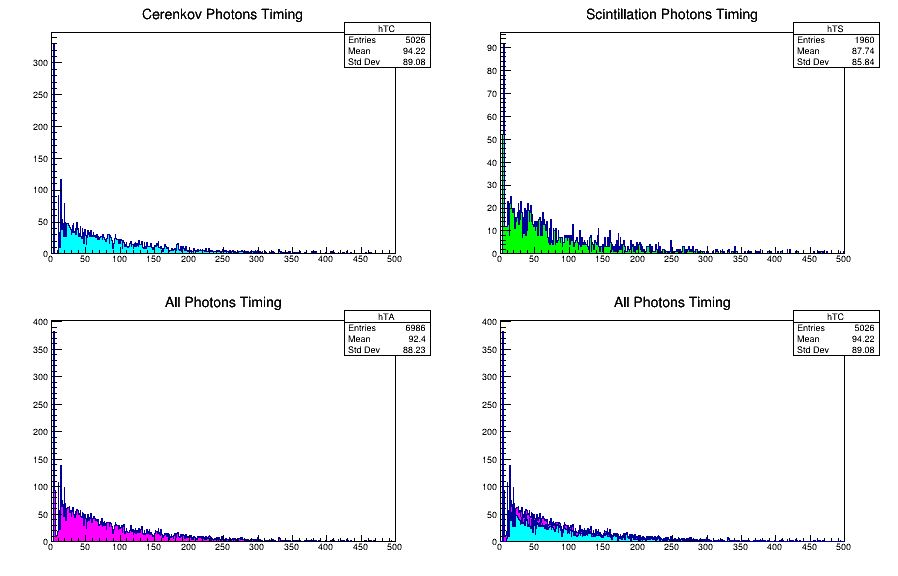

# liquidScint


## How to build
```bash
$ mkdir liquidScint
$ cd liquidScint
$ git clone git@github.com:HoyongJeong/liquidScint.git source
$ mkdir build
$ cd build
$ cmake ../source
$ make -j
```


## How to run

### Print help message
`./liquigScint -h` shows help message:
```bash
$ ./liquigScint -h
usage: liquidScint [-b] [-g] [-m macrofile]

Examples:
  liquidScint -b -m myRun.mac  # Run in batch mode with macro.
  liquidScint -g               # Run in graphical mode.

Options:
  -b  Execute in batch mode
  -g  Execute in graphical mode
      Note: Default is command mode
  -h  Show help message
  -m  Run with macro
```

### Graphical Mode
Executing `./liquidScint -g` will open w GUI window like,


Typing a command such as `/run/beamOn 1` generates a primary particle:


With wire frame view, one can see photons inside the liquid scintillator:


### CLI Mode
`./liquidScint` opens a command-line interface.

### Batch Mode
Running GEANT4 simulation in GUI mode, in general, requires graphical resource, thus really slow and takes a lot of time, even the process may be broken.
A batch run is recommended to get sizable statistics. The code includes an example macro file `run_10k.mac`. This macro runs 10,000 events.
```bash
./liquidScint -b -m run_10k.mac
```

## After Simulation
ROOT files with name of `liquidScint_YYYY-MM-DD_HH_mm_SS_tN.root` will be created. N can vary depending on multithreading configuration.
The tree structure is simple. The following is a printed result of a summary of the tree contents:
```bash
$ root -l liquidScint_YYYY-MM-DD_HH_mm_SS_tN.root
root [0]
Attaching file liquidScint_YYYY-MM-DD_HH_mm_SS_tN.root as _file0...
(TFile *) 0x56509f7ce4c0
root [1] .ls
TFile**         liquidScint_YYYY-MM-DD_HH_mm_SS_tN.root
 TFile*         liquidScint_YYYY-MM-DD_HH_mm_SS_tN.root
  KEY: TTree    liquidScint;1   Cerenkov and Scintillation
root [2] liquidScint -> Print();
******************************************************************************
*Tree    :liquidScint: Cerenkov and Scintillation                             *
*Entries :     1748 : Total =           73037 bytes  File  Size =      38489 *
*        :          : Tree compression factor =   1.00                       *
******************************************************************************
*Br    0 :eventID   : Int_t liquidScint                                      *
*Entries :     1748 : Total  Size=      14661 bytes  One basket in memory    *
*Baskets :        0 : Basket Size=      32000 bytes  Compression=   1.00     *
*............................................................................*
*Br    1 :creProcID : Int_t liquidScint                                      *
*Entries :     1748 : Total  Size=      14671 bytes  One basket in memory    *
*Baskets :        0 : Basket Size=      32000 bytes  Compression=   1.00     *
*............................................................................*
*Br    2 :timing    : Double_t liquidScint                                   *
*Entries :     1748 : Total  Size=      21656 bytes  One basket in memory    *
*Baskets :        0 : Basket Size=      32000 bytes  Compression=   1.00     *
*............................................................................*
*Br    3 :energy    : Double_t liquidScint                                   *
*Entries :     1748 : Total  Size=      21656 bytes  One basket in memory    *
*Baskets :        0 : Basket Size=      32000 bytes  Compression=   1.00     *
*............................................................................*
```


## Drawing histogram
Please use scripts/DrawHist.C or write by yourself.
```bash
$ root scripts/DrawHist.C
```
The script draws histograms of time distribution. The time is when photons are detected by PMT. t = 0 is when the primary particle is shot.
An image file will be written if you execute the `DrawHist.C` script:

- First pad: MC truth time spectrum of Cerenkov photons
- Second pad: MC truth time spectrum of scintillation photons
- Third pad: MC truth time spectrum of all photons
- Fourth pad: Cerenkov histogam on all histogram


## Development Guid
1. If you want to change material property? Go to the line 139 of src/LSDetCon.cc
2. If you want to change surface property? Go to the line 91 of src/LSDetCon.cc
3. If you want to edit ntuple structure? Go to the line 31 of src/LSRunAct.cc
4. If you want to revise data acquisition? Go to the line 80 of the src/LSSteAct.cc


## History
= [1.0.1] 13th Jul 2024 by Hoyong Jeong =
  - README update
  - Add a sample macro file

= [1.0.0] 8th Jun 2024 by Hoyong Jeong =
  - First version of liquidScint
